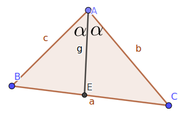

# 常用结论

[toc]

## 其他

> $f(x)$的周期性，单调性判断

 - 形如$f(x+a)=f(x+b)$，即`f(x)`内$x$`系数相同，得周期$T=|a+b|$
 - 形如$f(x+a)=f(-x+b)$，即`f(x)`内$x$系数相反，得关于$x=\frac{a+b}2$对称
 - 形如$f(x+a)=-f(-x+b)+c$，即`f(x)`内$x$系数相反且`f(x)`系数也相反，得关于$（\frac{a+b}2，\frac{c}2$​对称
 - 其他如$f(x+a)=-f(x+b)$，$f(x+a)=-\frac{1}{f(x+b)}$等，得周期$T=2|a-b|$
 - 既有对称点又有对称中心，则$T$为轴点之间距离的四倍

> 奇偶函数

- $ka^x+ka^{-x}$为偶函数
- $ka^x-ka^{-x}$为奇函数

> 对于$\sin{\omega}x$，$\cos{\omega}x$

- 周期$T=\frac{2\pi}{|\omega|}$是$\omega$的绝对值

## 三角

### 角平分线结论

- $\frac{S_{{\Delta}ABE}}{S_{{\Delta}AEC}}=\frac{BE}{CE}=\frac{\frac{1}2 \cdot AB\cdot AE \cdot \sin{\alpha}}{\frac{1}2 \cdot AC \cdot AE \cdot \sin{\alpha}}=\frac{AB}{AC}$

### 圆，椭圆的参数方程